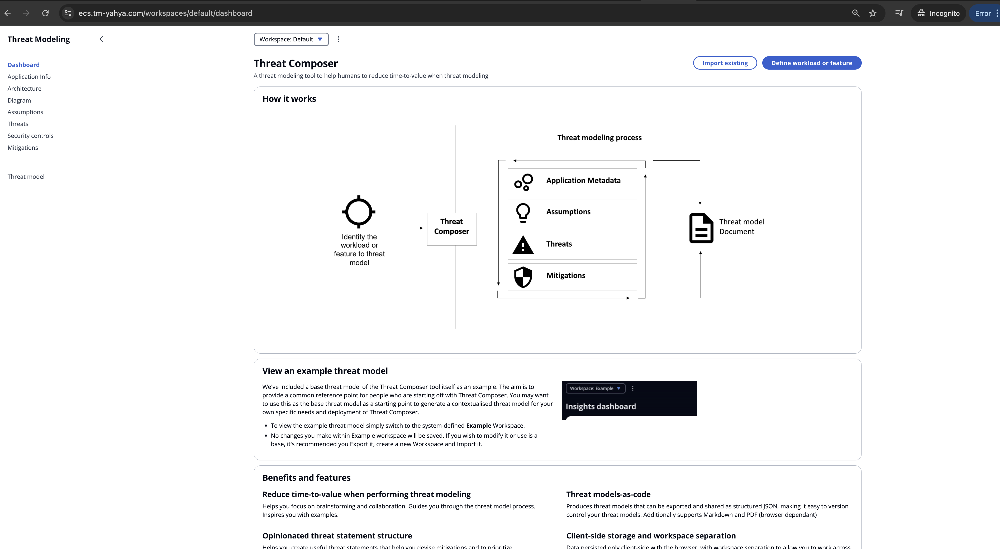

# 🛡️ **ThreatModelOps Documentation**

---

## 📝 **Introduction**

**ThreatModelOps** is a cloud-native solution that automates the deployment of a threat modelling application using **AWS**, **Docker**, **Terraform**, and **CI/CD pipelines**. This project streamlines infrastructure management, ensuring deployments are **secure**, **scalable**, and **efficient**. The application is securely hosted on **AWS** with a custom subdomain managed through **Amazon Route 53**.

Utilising **Amazon ECS** for container orchestration and **Terraform** for automated infrastructure provisioning, ThreatModelOps eliminates manual overhead while adhering to security best practices.

---

## 🎯 **Goal**

The primary objectives of **ThreatModelOps** are to:

- 🚀 Enable **rapid deployments** with minimal manual intervention.
- 🔄 Implement **continuous integration and deployment (CI/CD)** for seamless updates.
- 🔐 Integrate **security best practices** at every stage of deployment.
- 📈 Build a **scalable and resilient** cloud infrastructure.

---

## 🌟 **Key Features**

- ⚙️ **Automated Infrastructure:** Deploy and manage AWS resources using Terraform.
- 📦 **ECS Deployment:** Containerised application deployment with high availability and scalability.
- 🔄 **CI/CD Pipelines:** Automated build, test, and deployment processes via GitHub Actions.
- 🔐 **Security Focus:** Encrypted communications, secure access, and comprehensive monitoring.
- 🌐 **Custom Domain:** Application hosted with HTTPS using ACM and managed via Route 53.

---

## 🧰 **Technologies Used**

### 🖥️ **AWS Services:**

- 🐳 **ECS (Elastic Container Service):** Orchestrates Docker containers.
- 📦 **ECR (Elastic Container Registry):** Stores and manages Docker images.
- 🌐 **ALB (Application Load Balancer)** with **ACM (AWS Certificate Manager)** for HTTPS.
- 🗺️ **Route 53:** DNS management.
- 🛡️ **IAM:** Secure role-based access control.
- 📊 **CloudWatch:** Monitoring and logging.

### 🛠️ **Other Tools:**

- 📝 **Terraform:** Infrastructure as Code (IaC) for resource provisioning.
- 🐳 **Docker:** Containerisation platform for the application.
- 🔄 **GitHub Actions:** Manages CI/CD workflows.

---

## 🚀 **Getting Started**

### ✅ **Prerequisites**

Ensure you have the following installed and configured:

- 🛡️ An **AWS account** with the appropriate permissions.
- 📥 **[Terraform](https://www.terraform.io/downloads)** (v1.3.0 or above).
- 🐳 **[Docker](https://docs.docker.com/get-docker/)**.
- 🧑‍💻 **GitHub account** for CI/CD integration.
- 📦 **AWS CLI** for configuring credentials.

---

### 🏗️ **Deployment Instructions**

#### 1️⃣ **Clone the Repository**

```bash
git clone https://github.com/your-repo/threatmodelops.git
cd threatmodelops
```

---

#### 2️⃣ **Configure AWS Credentials**

```bash
aws configure
```

This sets up your AWS Access Key, Secret Access Key, and default region.

---

#### 3️⃣ **Build and Push Docker Image**

```bash
# Navigate to the application directory
cd app

docker build -t threatmodel-app .
aws ecr create-repository --repository-name threatmodel-app  # If not already created

docker tag threatmodel-app:latest <aws_account_id>.dkr.ecr.<region>.amazonaws.com/threatmodel-app:latest
docker push <aws_account_id>.dkr.ecr.<region>.amazonaws.com/threatmodel-app:latest
```

✅ This builds the Docker image and pushes it to **Amazon ECR**.

---

#### 4️⃣ **Deploy Infrastructure with Terraform**

```bash
cd terraform
terraform init  # Initialise Terraform
terraform validate  # Validate Terraform code
terraform plan  # Preview infrastructure changes
terraform apply -auto-approve  # Apply changes
```

✅ Provisions the following infrastructure:

- 🌐 **VPC** with public subnets for ECS services.
- 📦 **ECS Cluster** with Fargate launch type.
- 🔒 **ALB** with HTTPS configured via ACM.
- 🗺️ **Route 53** DNS record for application access.

---

#### 5️⃣ **Configure CI/CD Pipelines**

GitHub Actions are set up for **build, deployment**, and **destruction** workflows.

##### 📦 **CI Workflow (Build & Push to ECR)**

Located at: `.github/workflows/ci.yml`

- Builds Docker images and pushes them to ECR.
- Ensures images are up-to-date on code changes.

##### 🚀 **CD Workflow (Deploy Infrastructure)**

Located at: `.github/workflows/cd.yml`

- Deploys Terraform-managed infrastructure to AWS.
- Requires GitHub secrets for AWS credentials.

##### 🗑️ **Destroy Workflow (Clean Up Resources)**

Located at: `.github/workflows/destroy.yml`

- Tears down infrastructure when no longer needed.

---

#### 6️⃣ **Access the Application**

After deployment:

1. Navigate to **Route 53** and find your hosted zone.
2. Copy the configured **domain name**.
3. Open it in your browser to access the application via HTTPS. 🌐

---

## 🔒 **Security Considerations**

- 🛡️ **HTTPS Enabled:** All communications are secured via ALB and ACM certificates.
<!-- - 🔑 **IAM Policies:** Resources use the principle of least privilege.
- 🔐 **Secrets Management:** AWS Secrets Manager is recommended for sensitive data.
- 📊 **Monitoring:** CloudWatch logs and metrics are enabled for infrastructure components. -->
- 🚫 **Security Groups:** Only necessary ports (80, 443, 3000) are open, with ingress restricted to trusted CIDR blocks.

---

## 🚀 **What's Next?**

- 🔒 **Enhance Security:** Move ECS services into private subnets with NAT gateways.
- ♻️ **Improve Terraform Code:** Modularise infrastructure for better reusability.
- 📈 **Autoscaling:** Implement ECS service autoscaling policies.
- 🧪 **Testing:** Introduce infrastructure testing with **Terratest**.
- 🏷️ **Version Control:** Use semantic versioning for Terraform modules.
- ⚡ **Optimise Workflows:** Add a `Makefile` to streamline commands.

---

## 🖼️ **Visual Reference**



---
